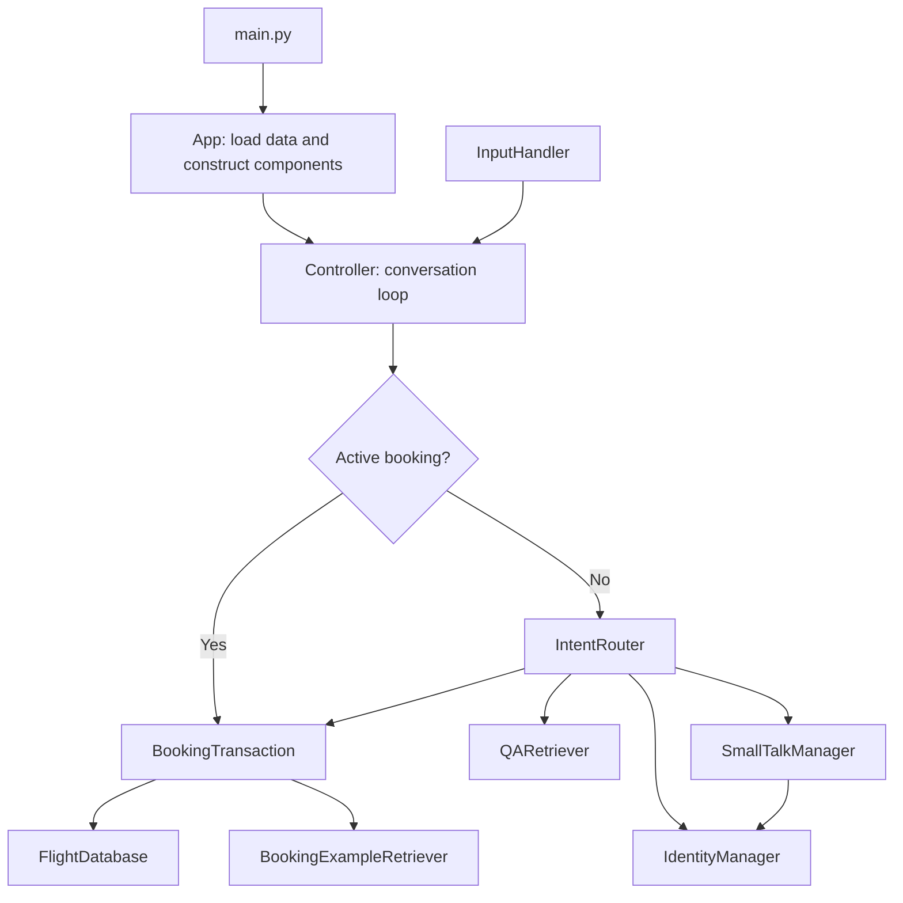

# NLP Flight Booking Chatbot

A Python command-line chatbot that combines example-based intent recognition, retrieval-based question answering, and a stateful flight-booking dialogue. It demonstrates how statistical text matching and explicit dialogue rules can work together in a small, modular application.

Bookings are **simulated**: confirmation produces a message and updates in-memory state. The application does not reserve airline seats, take payments, or store bookings.

## Features

- Classifies input into booking, question answering, identity, small talk, and help intents using TF-IDF and cosine similarity.
- Collects departure city, destination, date, departure time, and passenger count across multiple turns.
- Validates routes and departure times against a local timetable, suggesting nearby scheduled times when a requested time is unavailable.
- Lists destinations and departure times during an active booking conversation.
- Supports booking cancellation, restarting, and confirmation; rejects travel on Sundays.
- Remembers a user's name for the current session and uses it in greetings.
- Retrieves answers from a supplied question-and-answer dataset using candidate selection and weighted reranking.

## Architecture

`main.py` starts `App`, which loads the datasets and constructs the components. `Controller` owns the input loop and dispatches messages to the appropriate handler. An active `BookingTransaction` receives subsequent messages directly until completion or cancellation, preserving the booking context across turns.



See [docs/ARCHITECTURE.md](docs/ARCHITECTURE.md) for routing precedence, retrieval scoring, booking states, and data contracts.

## Technologies

The chatbot uses Python, NumPy, and scikit-learn, with standard-library CSV, JSON, regular-expression, and date handling. `heat_map.py` additionally uses pandas, Matplotlib, and seaborn.

The supplied `requirements.txt` pins a broader environment, including spaCy, its large English model, and NLTK. These are not imported by the current chatbot implementation; no language-model API or external service is required to run it.

## Project structure

```text
CW-CheckPoint/
├── main.py                   # CLI entry point
├── app.py                    # Dataset paths and dependency assembly
├── controller.py             # Conversation loop and dispatch
├── input_handler.py          # Console input and exit commands
├── intent_router.py          # TF-IDF intent matching
├── booking.py                # Booking state, slot extraction and validation
├── booking_retrieval.py      # Similar booking examples and slot suggestions
├── handle_flight.py          # Timetable index and route/time lookup
├── qa_retriever.py           # Question retrieval and answer reranking
├── identity_manager.py       # Session name handling
├── small_talk_manager.py     # Rule-based conversational replies
├── performance.py            # Dataset-based diagnostic evaluation
├── heat_map.py               # Standalone questionnaire visualization
├── requirements.txt          # Pinned dependencies
└── data/
    ├── intents.csv           # Intent examples
    ├── flight.csv            # Booking utterances and annotated slots
    ├── times.csv             # Available routes and departure times
    ├── COMP3074-CW1-Dataset.csv # Questions and answers
    └── flight_booking.json   # Alternative booking schema
```

## Installation

Use Python **3.11 or newer** for the pinned dependencies; Python 3.12 is a suitable choice. From the repository root, create and activate a virtual environment:

```bash
python3 -m venv .venv
source .venv/bin/activate
cd CW-CheckPoint
python -m pip install -r requirements.txt
```

On Windows, activate with `.venv\Scripts\Activate.ps1` in PowerShell before changing into `CW-CheckPoint`.

The full dependency installation downloads the large spaCy model from GitHub, even though the chatbot does not use it. For a smaller environment dedicated to running the chatbot and its diagnostic evaluation, install just its direct third-party dependencies instead:

```bash
python -m pip install numpy==2.3.4 scikit-learn==1.7.2
```

The smaller installation does not provide the optional plotting tools. The checked-in dependency file is unchanged.

## Usage

Run from **`CW-CheckPoint`**, because dataset paths are relative to the working directory:

```bash
python main.py
```

Start with `book a flight from London to Madrid`. Enter missing details when prompted, then confirm with `yes`. Use `help` for guidance. During booking, `show times` lists the route's scheduled departures, `cancel` ends the transaction, and `restart` clears the collected details. `exit` or `quit` closes the application, including during a booking.

Relative dates such as `tomorrow` and weekday names such as `next monday` should be entered as standalone replies. Numeric dates use `DD/MM/YYYY` or `DD-MM-YYYY`; times can use `HH:MM` or forms such as `9am`. The current parser does not accept every natural-language date expression.

### Example interaction

The following booking sequence was exercised against the supplied timetable. The displayed confirmation is a simulation.

```text
You: book a flight from London to Madrid
Bot: On which date would you like to travel?
You: 12/10/2026
Bot: At what time would you like to travel?
You: 10:20
Bot: Okay, just to confirm: you want to fly from London to Madrid on 2026-10-12 at 10:20 for 1 passenger(s). Is that correct?
You: yes
Bot: Your flight from London to Madrid on 2026-10-12 at 10:20 for 1 passenger(s) has been booked️!
You: exit
Bot: Goodbye!
```

## Implementation decisions

- **Example-based routing:** unigram and bigram TF-IDF matching selects the nearest intent example. Scores below `0.30` produce an unknown intent rather than dispatching to a handler.
- **Transaction ownership:** booking bypasses the general intent router while active, so short replies can fill missing slots without being classified as unrelated intents.
- **Rules with retrieval assistance:** regular expressions extract booking details first. Similar booking examples can fill remaining slots when their similarity reaches `0.65`; suggested cities must be present in the timetable.
- **Timetable authority:** routes and times are checked independently of retrieved examples, so a similar utterance cannot establish flight availability.
- **Explicit confirmation:** the booking moves from collecting details to confirming and then to completed or cancelled. A negative confirmation resets the details for another attempt.

## Validation and evaluation

From `CW-CheckPoint`, run the existing diagnostic script:

```bash
python performance.py
```

It reports booking-example retrieval, per-slot extraction, exact slot matches, and whether annotated routes and times exist in the timetable. Retrieval is evaluated against the same example file used to build its index, so its reported “Recall” is not a held-out estimate of generalization. Route/time figures describe dataset consistency rather than end-to-end booking success. Relative-date resolution also depends on the current date.

The CLI booking example above and this diagnostic script ran successfully during documentation review using Python 3.12.14, NumPy 2.3.5, and scikit-learn 1.8.0 already installed in the review environment. The complete pinned dependency installation was not tested. There is no automated assertion-based test suite in the repository.

## Limitations

- No live airline integration, seat inventory, prices, payment processing, booking database, or persistent user profiles.
- Intent recognition depends on a small example set and lexical similarity; unfamiliar phrasing can route incorrectly.
- Question answering selects an existing dataset answer and has no answer-confidence rejection threshold.
- Date parsing is limited, does not reject past dates, and can raise an exception for impossible dates such as `31/02/2026`.
- City matching uses substrings; passenger and confirmation parsing also use simple rules and can misinterpret ambiguous input.
- Retrieved examples can supply dates and times not explicitly requested by the user; confirmation is therefore important.
- The default CLI uses the schema embedded in `booking.py`. The alternative JSON schema is not loaded automatically.
- All indexes are built at startup. Data paths assume the documented working directory, and console input has no dedicated end-of-file recovery.
