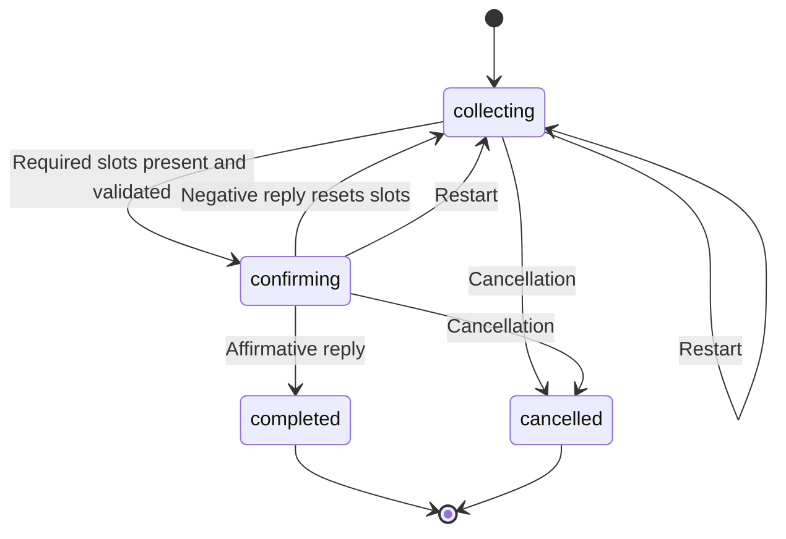

# Architecture

## Application assembly and control flow

`main.py` calls `App().run()`. `App` creates one input handler, intent router, identity manager, small-talk manager, question-answer retriever, flight database, and booking-example retriever. It passes these dependencies to `Controller`; small talk shares the identity manager so greetings can use the session name.

The controller processes each turn in this order:

1. Read and strip console input; `exit` and `quit` terminate immediately.
2. If a booking is active, pass the message to it directly. Clear the transaction after completion or cancellation, then continue to the next turn.
3. Otherwise predict an intent. If the identity manager is awaiting a name, first attempt to consume the reply as a name.
4. Dispatch to identity, question answering, small talk, capabilities, or booking. Unknown intents receive a rephrasing prompt.

Most components return structured results or response strings. Identity and small-talk handlers print their responses directly; the controller prints question-answer and booking responses. The application has no network service or background worker.

## Intent recognition

`IntentRouter` reads sentence/label pairs from `intents.csv`, fits a unigram/bigram `TfidfVectorizer` without stop-word removal, and stores the resulting sparse matrix. Each input is transformed into that vocabulary and compared with all examples using cosine similarity. The highest-scoring example supplies its label and identifier; a score below `0.30` changes the label to `unknown`.

This is nearest-example retrieval rather than a separately trained probabilistic classifier. The score is a similarity value, not a calibrated probability.

## Booking transaction

`BookingState` holds the slot dictionary, required and optional slot lists, transaction status, and passenger clarification state. The default required slots are departure city, arrival city, date, and time; passenger count starts at one.



Cancellation, restart, and help checks precede ordinary slot filling. During collection, destination/time lookup requests can return guidance without advancing the transaction. Otherwise the transaction:

1. Extracts cities, date, time, and passengers using rules and regular expressions.
2. Uses a retrieved booking example with similarity at least `0.65` to fill still-empty slots, restricting suggested cities to known timetable cities.
3. Asks for a count if plural wording indicates multiple passengers without a number.
4. Rejects Sundays, unsupported routes, and departure times absent from the route's timetable. Invalid details are cleared so the user can supply replacements.
5. Prompts for the next missing required slot, then requests confirmation.

Nearest-time suggestions use absolute differences in minutes since midnight, not a circular midnight-aware distance. Relative dates resolve against the machine's local current date. Confirmation uses substring checks for affirmative and negative phrases; completion only updates state and returns a simulated booking message.

`BookingTransaction` accepts an optional schema path. Missing or unreadable schemas fall back to its embedded defaults. `App` and `Controller` do not pass `data/flight_booking.json`, whose declaration differs by treating departure time as optional; the transaction additionally enforces a time before confirmation.

## Retrieval components

### Booking examples

`BookingExampleRetriever` builds a separate unigram/bigram TF-IDF index over annotated booking utterances. `suggest()` returns the nearest utterance, its cosine score, and its populated slots. The transaction applies the acceptance threshold, preserves slots already filled, and validates the resulting route/time against the timetable. Because passengers default to one, example suggestions normally cannot replace that slot.

### Question answering

`QARetriever` fits two independent unigram/bigram TF-IDF indexes with English stop-word removal: one over questions and one over answers. It takes the five closest questions by cosine similarity, then reranks them using:

```text
score = 0.45 × question similarity
      + 0.20 × answer similarity
      + 0.15 × answer token coverage
      + 0.10 × question token coverage
      − 0.06 × question extra-token fraction
      − 0.04 × answer extra-token fraction
```

Coverage measures how much of the user's token set occurs in the candidate; extra-token fractions penalize candidate terms absent from the input. These overlap calculations use alphabetic tokens of at least two characters, independently of vectorizer stop-word removal. The highest-scoring candidate's stored answer is returned without a minimum-score rejection rule. The controller displays only the answer text.

## Timetable and data contracts

`FlightDatabase` loads a CSV into a dictionary keyed by immutable `FlightKey(dep, arr)` objects. Cities are normalized to lowercase; duplicate route times are removed and valid times sorted. Rows missing route/time values or containing invalid times are skipped. Lookup methods provide known cities, route existence, times, destinations, reverse departures, and nearest times. Availability is static and has no capacity or date-specific schedule.

| File | Required columns / purpose | Consumer |
| --- | --- | --- |
| `intents.csv` | `IID`, `sentence`, `label`: intent examples | `IntentRouter` |
| `flight.csv` | `utterance` plus annotated city, date, time, and passenger slots | `BookingExampleRetriever`, diagnostic script |
| `times.csv` | `departure_city`, `arrival_city`, `departure_time`: timetable | `FlightDatabase` |
| Q&A CSV | `QuestionID`, `Question`, `Answer`: stored responses; `Document` is not used by retrieval | `QARetriever` |
| `flight_booking.json` | Task name and required/optional slot lists | Only used if a caller explicitly supplies its path |

Dataset paths are configured as relative constants in `app.py`. There is no database or persisted model file: CSV data is read and retrieval matrices are built at each startup. Session identity and booking state disappear when the process exits.

## Diagnostics and scope

`performance.py` evaluates nearest-example city retrieval, rule-only slot filling, and annotated route/time consistency. It disables booking-example assistance for the slot-filling diagnostic and does not exercise the full controller dialogue. Its retrieval index and evaluation examples come from the same file; output should not be treated as an independent benchmark.

`heat_map.py` is a standalone visualization of embedded questionnaire responses and is not part of chatbot startup. Its plot title and embedded data disagree on participant count, so it should not be used to substantiate usability claims without separate review.

The application separates routing, retrieval, timetable access, and dialogue state, making each responsibility identifiable. Current boundaries remain oriented toward a console prototype: some handlers print directly, input parsing is heuristic, and there is no booking persistence or external reservation integration.
